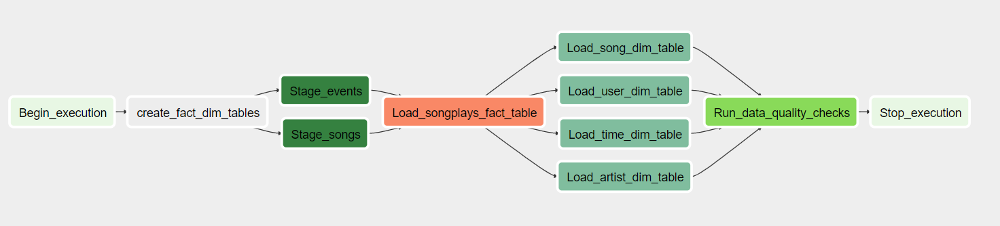

# Airflow Data Pipeline for AWS S3 -> Redshift

**Project by Berk Hakbilen**

## Introduction

A project to create high grade data pipelines that are dynamic and built from reusable tasks, can be monitored, and allow easy backfills.

The source data resides in S3 and needs to be processed in Sparkify's data warehouse in Amazon Redshift. The source datasets consist of JSON logs that tell about user activity in the application and JSON metadata about the songs the users listen to.




## Project Directory Structure
```
airflow-data-pipeline
│   README.md                    # Readme
│   docker-compose.yml           # Docker container configuration  
│   requirements.txt             # Requreiments file including python dependencies
└───airflow                      # Main airflow directory
|   |               
│   └───dags                     
│   |      main_dag.py  #Python file to create and configure the DAG
|   |      create_tables.sql  #SQL queries to create the staging,fact and dimension tables on redshift
|   └───plugins
│       │  
|       └───helpers
|       |      sql_queries.py     # SQL queries to insert data into tables
|       |
|       └───operators
|       |      data_quality.py    # DataQualityOperator
|       |      load_dimension.py  # LoadDimensionOperator
|       |      load_fact.py       # LoadFactOperator
|       |      stage_redshift.py  # StageToRedshiftOperator
```

### Requirements

* [Python3](https://www.python.org/downloads/)
* [Docker](https://www.docker.com/)
* [Docker Compose](https://docs.docker.com/compose/install/)
* [AWS](https://aws.amazon.com/) account and [Redshift](https://aws.amazon.com/redshift/) cluster 

## Quick Start

#### Clone repository to local machine

 clone the repository to your local directory

#### Create python virtual environment
```
python3 -m venv venv             # create virtualenv
source venv/bin/activate         # activate virtualenv
pip install -r requirements.txt  # install requirements
```

#### Start the docker container
Feel free to run the docker container directly if you are satisfied with default configuration.
```
docker-compose up
```

#### Check the Airflow UI
Go to http://localhost:8080

Username: user 

Password: password

#### Configure Airflow connections for AWS and Redshift

1. Click on the Admin tab and select Connections.
2. 


2. Under Connections, select Create.

3. On the create connection page, enter the following values:
- Conn Id: Enter aws_credentials.
- Conn Type: Enter Amazon Web Services.
- Login: Enter your Access key ID from the IAM User credentials.
- Password: Enter your Secret access key from the IAM User credentials.
- 


Once you've entered these values, select Save and Add Another.

4. On the next create connection page, enter the following values:
- Conn Id: Enter redshift.
- Conn Type: Enter Postgres.
- Host: Enter the endpoint of your Redshift cluster without the port at the end.
- Schema: Enter the Redshift database you want to connect to.
- Password: Enter the password you created when launching your Redshift cluster.
- Port: Enter 5439.

Once you've entered these values, select Save.

#### Start the DAG
Start the DAG by switching it state from OFF to ON.

Refresh and click on the main_dag to view the current state.

Check for any errors that may come up in the pipeline.

